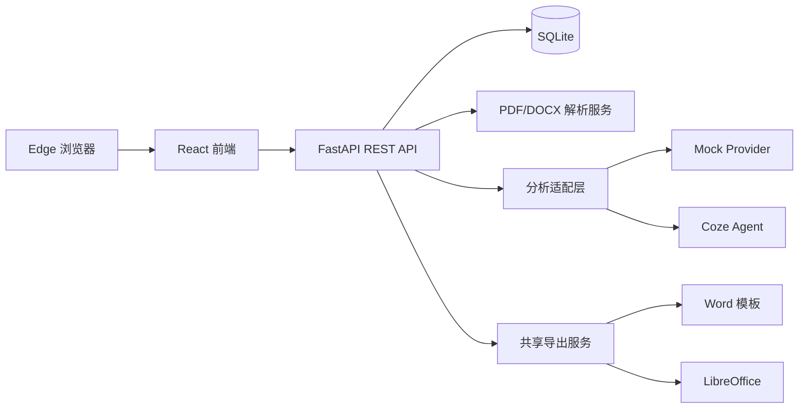

# 简历智造——ResumeMatch

简历智造（ResumeMatch） 是一个面向求职场景的简历构建与职位描述（Job Description，以下简称 JD）匹配系统。系统支持从表单、文本型 PDF 或 DOCX 中录入简历，将内容拆分为结构化条目，并根据目标 JD 分析匹配程度、提供不虚构事实的优化建议，最终导出 Word 或 PDF 简历。

本项目为两人协作的软件工程实践项目，首版面向中文简历、单用户和本机 Edge 桌面端，不包含账号系统与公网部署。

## 1. 项目目标

- 降低简历创建、整理和格式调整成本。
- 将非结构化简历转换为可编辑、可排序、可复用的结构化数据。
- 根据不同 JD 展示简历条目的相关程度和缺失要求。
- 在不虚构技能、经历和成果的前提下辅助用户改进表达。
- 使用同一导出服务生成普通简历和针对特定 JD 优化后的简历。
- 保存简历、分析记录和版本历史，避免调整过程覆盖原始内容。

## 2. 项目范围

- 中文简历和中文 JD。
- 分模块手动录入和整段文本粘贴。
- 文本型 PDF、DOCX 文件导入，单文件最大 10 MB。
- 简历结构化拆分、人工校正、草稿和历史版本。
- JD 总体匹配分、逐条匹配状态、缺失要求和改进建议。
- 模块排序和模块内条目排序。
- 两个人工提供的 Word 模板。
- DOCX 与 PDF 导出。
- SQLite 本地持久化。

## 3. 业务模块

系统由两个独立业务闭环和一个共享导出服务组成。导出能力不单独作为业务模块。

### 3.1 模块 A：简历构建与基础导出

负责人：A1。

业务流程：

```text
创建简历 -> 手动录入或文件拆分 -> 校正编辑 -> 保存版本 -> 导出普通简历
```

功能定义：

1. 创建简历：新建简历名称和基础信息。
2. 手动录入：通过分模块表单新增、编辑和删除条目。
3. 文本粘贴：粘贴完整简历文本后执行规则拆分。
4. 文件导入：从文本型 PDF 或 DOCX 提取文本并拆分。
5. 拆分校正：用户确认和修正识别结果后才能保存正式版本。
6. 版本管理：保存草稿、生成不可变版本、查看历史版本。
7. 基础导出：选择历史版本、模板和文件格式进行导出。

简历模块包括：

- 基本信息。
- 教育经历。
- 工作或实习经历。
- 项目经历。
- 技能、证书和奖项。
- 用户自定义模块。

拆分采用规则优先策略，根据中文模块标题、联系方式、日期区间等特征识别结构。所有结果均允许人工修正。无法提取文字时，系统提示扫描件暂不支持，并保留用户已填写的数据。

### 3.2 模块 B：JD 匹配与定向优化导出

负责人：A2。

业务流程：

```text
选择已保存版本 -> 输入 JD -> 匹配分析 -> 调整内容和顺序 -> 保存定向版本 -> 导出定制简历
```

功能定义：

1. 版本选择：选择模块 A 已保存的 `ResumeVersion`，不重复上传和拆分。
2. JD 输入：录入目标岗位的完整职位描述。
3. 匹配分析：展示 0-100 总分和每个简历条目的高、中、低相关度。
4. 缺失分析：展示 JD 要求但当前简历未体现的关键词或能力。
5. 内容建议：对照展示原文、建议文本和修改理由。
6. 建议确认：逐条接受、拒绝或手工编辑建议，禁止静默覆盖原文。
7. 拖动调整：调整模块顺序和同一模块内条目顺序。
8. 定向版本：将确认后的内容显式保存为新版本，保留父版本关系。
9. 定制导出：调用共享导出服务生成针对该 JD 的 DOCX 或 PDF。

Coze Agent 只负责结构化简历与 JD 的匹配分析和表达优化，不参与文件解析和初始简历拆分。模型提出的内容必须通过后端结构校验；缺少事实依据的要求只能作为提示，不得写入简历。

### 3.3 共享导出服务

负责人：A1主责，A2通过统一接口调用。

共享服务接收 `ResumeVersion ID`、模板 ID 和导出格式，不区分版本来自模块 A 还是模块 B。相同版本、模板和格式应生成一致结果。

导出流程：

1. 读取不可变的 `ResumeVersion` 快照。
2. 将结构化字段渲染到人工提供的 Word 模板。
3. 生成可编辑的 DOCX 文件。
4. 使用 LibreOffice Headless 将 DOCX 转换为 PDF。
5. 保存导出记录并提供下载。

## 4. 系统架构



建议采用 Monorepo：

```text
resume-match/
├─ frontend/                 # React 前端
├─ backend/                  # FastAPI 后端
├─ e2e/                      # 端到端测试
├─ docs/                     # 需求、设计、接口和测试报告
├─ .env.example              # 环境变量示例，不包含真实密钥
└─ README.md
```

模块之间以 REST API 和 `ResumeVersion ID` 对接，不直接访问对方内部服务。`ResumeDocument` 是解析、分析、编辑和导出的唯一公共数据契约。

## 5. 技术栈

| 层级 | 技术 | 用途 |
| --- | --- | --- |
| 前端 | React + TypeScript + Vite | 页面与交互 |
| 路由 | React Router | 模块和页面路由 |
| 服务端状态 | TanStack Query | API 请求、缓存和错误状态 |
| 拖动排序 | dnd-kit | 模块和条目排序 |
| 后端 | Python + FastAPI | REST API 与业务服务 |
| 数据校验 | Pydantic | API 和 Coze 输出校验 |
| ORM | SQLAlchemy | 数据持久化 |
| 数据迁移 | Alembic | SQLite 表结构版本管理 |
| 数据库 | SQLite | 本机简历、版本和分析历史 |
| PDF 提取 | PyMuPDF | 文本型 PDF 内容提取 |
| Word 处理 | python-docx | DOCX 读取和生成 |
| PDF 导出 | LibreOffice Headless | DOCX 转 PDF |
| AI | Coze Agent | JD 匹配与内容优化 |
| 后端测试 | pytest + HTTPX | 单元测试和 API 测试 |
| 前端测试 | Vitest + Testing Library | 组件和交互测试 |
| 端到端测试 | Playwright | Edge/Chromium 主流程测试 |

## 6. 核心数据定义

### 6.1 ResumeDocument

```json
{
	"basicInfo": {
		"name": "张三",
		"phone": "13800000000",
		"email": "example@example.com",
		"location": "杭州",
		"jobTarget": "后端开发工程师"
	},
	"sections": [
		{
			"id": "section_project",
			"type": "project",
			"title": "项目经历",
			"order": 0,
			"items": [
				{
					"id": "item_project_1",
					"order": 0,
					"fields": {
						"name": "ResumeMatch",
						"role": "后端开发",
						"startDate": "2026-09",
						"endDate": "2026-12"
					},
					"content": "负责简历解析、版本管理和导出服务。"
				}
			]
		}
	]
}
```

约束：

- section 和 item 的 ID 创建后保持稳定。
- `order` 为从 0 开始的整数，同一层级内不得重复。
- `type` 允许 `education`、`experience`、`project`、`skill`、`award`、`custom`。
- 正式版本中的文档不可修改，修改操作必须进入草稿。

### 6.2 持久化实体

| 实体 | 关键字段 | 说明 |
| --- | --- | --- |
| Resume | id、title、createdAt、updatedAt | 一份简历的逻辑主体 |
| ResumeVersion | id、resumeId、version、parentVersionId、source、document | 不可变 JSON 快照 |
| Draft | id、resumeId、baseVersionId、document、updatedAt | 可变编辑内容 |
| Analysis | id、resumeVersionId、jdText、status、overallScore | 一次 JD 分析 |
| Suggestion | id、analysisId、sectionId、itemId、original、suggested、status | 条目建议 |
| ExportRecord | id、resumeVersionId、templateId、format、status、filePath | 导出记录 |

`ResumeVersion.source` 取值：

- `manual`：手动录入。
- `import`：文件或文本拆分。
- `optimized`：根据 JD 优化形成的新版本。

## 7. API 接口定义

统一前缀为 `/api`，请求和响应采用 JSON；文件上传使用 `multipart/form-data`，文件下载除外。FastAPI 自动生成 Swagger 文档。

### 7.1 通用响应和错误

成功响应：

```json
{
	"data": {},
	"requestId": "req_123"
}
```

错误响应：

```json
{
	"error": {
		"code": "UNSUPPORTED_SCANNED_PDF",
		"message": "未检测到可提取文本，请改用手动录入。",
		"details": {}
	},
	"requestId": "req_123"
}
```

主要错误码：

| 错误码 | HTTP 状态 | 场景 |
| --- | --- | --- |
| VALIDATION_ERROR | 422 | 请求字段或模型输出不符合契约 |
| FILE_TYPE_NOT_SUPPORTED | 415 | 上传非 PDF/DOCX 文件 |
| FILE_TOO_LARGE | 413 | 文件超过 10 MB |
| UNSUPPORTED_SCANNED_PDF | 422 | PDF 无可提取文本 |
| RESUME_NOT_FOUND | 404 | 简历不存在 |
| VERSION_NOT_FOUND | 404 | 简历版本不存在 |
| ANALYSIS_PROVIDER_ERROR | 502 | Coze 调用或响应校验失败 |
| ANALYSIS_TIMEOUT | 504 | Coze 调用超时 |
| EXPORT_DEPENDENCY_MISSING | 503 | LibreOffice 不可用 |
| EXPORT_FAILED | 500 | 模板渲染或格式转换失败 |

### 7.2 简历与版本接口

| 方法 | 路径 | 说明 |
| --- | --- | --- |
| POST | `/api/resumes` | 创建简历 |
| GET | `/api/resumes` | 获取历史简历列表 |
| GET | `/api/resumes/{resumeId}` | 获取简历详情和当前草稿 |
| POST | `/api/resumes/import` | 上传 PDF/DOCX 并返回待确认结构 |
| POST | `/api/resumes/parse-text` | 拆分用户粘贴的完整文本 |
| PUT | `/api/resumes/{resumeId}/draft` | 保存草稿和排序 |
| POST | `/api/resumes/{resumeId}/versions` | 从草稿创建不可变版本 |
| GET | `/api/resumes/{resumeId}/versions` | 获取历史版本列表 |
| GET | `/api/resume-versions/{versionId}` | 获取指定版本快照 |

创建版本请求：

```json
{
	"baseVersionId": "version_1",
	"source": "optimized",
	"document": {
		"basicInfo": {},
		"sections": []
	}
}
```

创建版本响应：

```json
{
	"data": {
		"id": "version_2",
		"resumeId": "resume_1",
		"version": 2,
		"parentVersionId": "version_1",
		"source": "optimized"
	},
	"requestId": "req_123"
}
```

### 7.3 JD 分析接口

| 方法 | 路径 | 说明 |
| --- | --- | --- |
| POST | `/api/analyses` | 对指定简历版本执行 JD 分析 |
| GET | `/api/analyses/{analysisId}` | 获取分析结果 |
| POST | `/api/analyses/{analysisId}/retry` | 重试失败的分析 |
| PATCH | `/api/suggestions/{suggestionId}` | 接受、拒绝或编辑建议 |

分析请求：

```json
{
	"resumeVersionId": "version_1",
	"jdText": "负责后端服务开发，熟悉 Python、FastAPI 和数据库设计。"
}
```

标准分析响应：

```json
{
	"data": {
		"id": "analysis_1",
		"resumeVersionId": "version_1",
		"status": "completed",
		"overallScore": 78,
		"itemMatches": [
			{
				"sectionId": "section_project",
				"itemId": "item_project_1",
				"level": "high",
				"reason": "项目使用 FastAPI，符合 JD 的后端框架要求。"
			}
		],
		"missingRequirements": [
			{
				"requirement": "高并发服务经验",
				"reason": "当前简历中没有可验证的相关描述。"
			}
		],
		"suggestions": [
			{
				"id": "suggestion_1",
				"sectionId": "section_project",
				"itemId": "item_project_1",
				"original": "负责后端开发。",
				"suggested": "使用 FastAPI 完成后端接口与数据模型开发。",
				"reason": "突出与 JD 相关且原简历已有依据的技术。",
				"status": "pending"
			}
		]
	},
	"requestId": "req_123"
}
```

分析契约约束：

- `overallScore` 必须为 0-100 的整数。
- `level` 只能为 `high`、`medium`、`low`。
- 每个 sectionId 和 itemId 必须存在于输入版本中。
- Suggestion 状态只能为 `pending`、`accepted`、`rejected`、`edited`。
- Coze 超时或响应非法时保留原始版本，不创建优化版本。
- 重试沿用原 Analysis 记录或建立明确关联，不得产生重复建议。

### 7.4 导出接口

| 方法 | 路径 | 说明 |
| --- | --- | --- |
| GET | `/api/export-templates` | 获取两份可用模板 |
| POST | `/api/resume-versions/{versionId}/exports` | 创建 DOCX/PDF 导出任务 |
| GET | `/api/exports/{exportId}` | 获取导出状态 |
| GET | `/api/exports/{exportId}/download` | 下载生成文件 |

导出请求：

```json
{
	"templateId": "classic_single_column",
	"format": "pdf"
}
```

导出响应：

```json
{
	"data": {
		"id": "export_1",
		"resumeVersionId": "version_2",
		"templateId": "classic_single_column",
		"format": "pdf",
		"status": "completed",
		"downloadUrl": "/api/exports/export_1/download"
	},
	"requestId": "req_123"
}
```

## 8. 页面与交互定义

| 页面 | 核心操作 |
| --- | --- |
| 简历列表 | 查看、创建、打开历史简历 |
| 简历创建 | 分模块填写、粘贴文本、上传文件 |
| 拆分校正 | 编辑识别结果、新增删除条目、保存版本 |
| 版本详情 | 查看版本来源、父版本、内容和历史 |
| JD 分析 | 选择版本、输入 JD、查看分析状态和结果 |
| 定向优化 | 对照建议、接受拒绝、手工编辑、拖动排序 |
| 导出 | 选择模板和格式、生成、查看状态、下载 |

分析调用期间页面显示明确进度。Coze 失败时保留 JD 和所有编辑内容，并提供重试按钮。拖动和文字编辑先保存为草稿，只有用户点击“保存为新版本”才生成正式快照。

## 9. 测试方案

### 9.1 测试分层

| 层级 | 工具 | 重点范围 |
| --- | --- | --- |
| 后端单元测试 | pytest | 文本拆分、数据校验、版本、分析适配、模板渲染 |
| 后端接口测试 | pytest + HTTPX | 状态码、响应契约、数据库副作用、异常处理 |
| 前端组件测试 | Vitest + Testing Library | 表单、错误提示、建议状态、拖动后的顺序 |
| 契约测试 | Pydantic + 固定 JSON | Mock 与 Coze 返回相同标准结构 |
| 端到端测试 | Playwright | Edge 桌面端的模块 A、模块 B 完整闭环 |
| 人工视觉测试 | 测试记录表 | 两份模板的字体、顺序、分页和 DOCX/PDF 一致性 |

### 9.2 测试数据

- 真实简历与真实 JD 只保存在 `.gitignore` 覆盖的本地目录。
- 仓库只提交脱敏 PDF、DOCX、文本、预期结构 JSON 和 Mock Coze 响应。
- 测试样本覆盖完整简历、缺失模块、乱序模块、重复标题、中文长文本和多页内容。
- AI 测试不固定具体措辞和精确分数，只验证 JSON 契约、分数范围、引用有效性和禁止虚构规则。

### 9.3 核心测试用例

| 编号 | 场景 | 预期结果 |
| --- | --- | --- |
| A-01 | 上传正常文本型 PDF | 返回可编辑的结构化简历 |
| A-02 | 上传正常 DOCX | 返回可编辑的结构化简历 |
| A-03 | 上传扫描版 PDF | 返回 `UNSUPPORTED_SCANNED_PDF`，提示手动录入 |
| A-04 | 上传超过 10 MB 文件 | 返回 `FILE_TOO_LARGE` |
| A-05 | 保存草稿并创建版本 | 草稿可继续修改，已创建版本保持不变 |
| A-06 | 使用两份模板导出 | DOCX/PDF 内容与所选版本一致 |
| B-01 | 选择有效版本并分析 JD | 返回总分、逐条状态、缺失要求和建议 |
| B-02 | Coze 超时 | 返回可重试错误，不创建优化版本 |
| B-03 | Coze 返回不存在的 itemId | 后端拒绝非法响应 |
| B-04 | 接受、拒绝和编辑建议 | 仅更新优化草稿，不修改原版本 |
| B-05 | 拖动模块和模块内条目 | 刷新后顺序保持正确 |
| B-06 | 保存定向版本 | 新版本关联正确的父版本和分析记录 |
| I-01 | 禁用 Coze 后使用模块 A | A 仍可创建、编辑和基础导出 |
| I-02 | 使用种子版本启动模块 B | B 无需文件解析即可分析、优化和导出 |
| I-03 | A/B 导出同一版本 | 相同模板和格式生成一致结果 |

### 9.4 验收标准

- 模块 A 可独立完成“创建或导入 -> 校正 -> 保存 -> 导出”。
- 模块 B 可从已有版本独立完成“分析 -> 优化 -> 保存 -> 导出”。
- 所有正式版本不可变，优化内容必须形成新版本。
- Coze 失败、文件异常或导出失败时不丢失用户数据。
- DOCX/PDF 字段内容与所选版本一致，两份模板不存在明显溢出和错位。
- Edge 桌面端可完整执行两条主流程。
- 自动化测试通过，并完成包含环境、用例、结果、截图和缺陷记录的测试报告。

## 10. 安全与隐私

- Coze Token、Bot ID 等敏感配置只通过后端环境变量读取。
- `.env`、真实简历、真实 JD、上传原件和导出文件必须加入 `.gitignore`。
- `.env.example` 只提供变量名和非敏感示例。
- 服务端同时校验文件扩展名、MIME 类型和大小，生成随机存储文件名。
- 下载接口校验 ExportRecord，不允许客户端直接拼接本地文件路径。
- 日志不得记录完整简历、JD、Token、电话或邮箱。
- 提交代码前执行密钥和个人信息检查，避免敏感内容进入 Git 历史。

## 11. 团队分工与协作

| 成员 | 主要职责 |
| --- | --- |
| A1 | 模块 A、PDF/DOCX 解析、简历版本、共享导出服务、两份模板接入 |
| A2 | 模块 B、Mock/Coze 适配、匹配结果、建议确认、拖动调整 |
| 共同负责 | 公共数据契约、数据库迁移、跨模块联调、测试和课程文档 |

Git 协作约定：

- 陈浩主要使用 `feature/resume-builder-export`。
- 陈仕安主要使用 `feature/jd-analysis-optimizer`。
- 公共契约和数据库变更使用独立的小型分支与 Pull Request。
- 每个 Pull Request 写明功能范围、接口变化和测试结果，由另一位成员评审。
- `main` 分支始终保持可启动，不在项目结束时一次性合并长期分支。

## 12. 最终交付物

- 可运行的前后端源代码。
- SQLite 数据迁移和初始化方式。
- 两份可用的 Word 导出模板。
- README 与本机部署说明。
- 需求说明和概要设计文档。
- 完整测试计划、测试用例、执行结果与缺陷记录。
- 演示 PPT 或视频。
- 包含两位成员持续提交和 Pull Request 记录的 GitHub 仓库。

## 13. 本机运行说明（当前进度：模块 A 后端）

### 13.1 本轮已完成

- 模块 A 后端 13 个接口：简历 CRUD、文本粘贴拆分、PDF/DOCX 导入、草稿与排序、
  不可变版本、版本快照查询。
- 共享导出服务：模板渲染 DOCX → LibreOffice Headless 转 PDF，导出记录与授权下载。
  模块 A 与模块 B 使用同一组端点，输入只有 `ResumeVersion ID`、模板 ID 与格式。
- 规则优先的中文拆分：模块标题识别、名称/角色/日期三列与三行式条目、
  「类别：内容」技能行、日期归一化、无法归类内容一律保留并给出提示。
- 公共契约 `ResumeDocument`（Pydantic，`extra="forbid"`）、统一响应与错误码、
  requestId 透传、SQLite + Alembic 迁移。
- 分析适配层接口 `AnalysisProvider` 与 `MockProvider`（模块 B 的接入点，当前无分析路由）。
- 测试：71 passed / 1 skipped（skip 为需要 LibreOffice 的 PDF 用例）。

设计细节见 `docs/module-a-design.md`、模板契约见 `docs/template-contract.md`、
测试说明见 `docs/testing.md`、补充错误码见 `docs/api-extensions.md`。

### 13.2 尚未包含

- `frontend/`（React 页面）与 `e2e/`（Playwright）目录。
- 模块 B 的 `/api/analyses`、`/api/suggestions` 接口与真实 Coze 调用。
- 第二份 Word 模板：当前只有 `classic_single_column`（格式取自参考简历的脱敏占位版）。

### 13.3 环境要求

- Python 3.10+（本机实测 3.12）。
- LibreOffice（仅 PDF 导出需要；未安装时 DOCX 导出正常，PDF 返回
  `EXPORT_DEPENDENCY_MISSING`）。

### 13.4 启动步骤

```powershell
cd c:\Users\admini\Desktop\softprojiect\resume-match
python -m venv .venv
.\.venv\Scripts\python.exe -m pip install -r backend\requirements.txt
Copy-Item .env.example .env          # 按需修改，切勿提交 .env

cd backend
..\.venv\Scripts\python.exe -m alembic upgrade head          # 建库（应用启动时也会自动执行）
..\.venv\Scripts\python.exe -m uvicorn app.main:app --reload --port 8000
```

- Swagger 文档：<http://127.0.0.1:8000/docs>
- 数据位置：`backend/data/resume_match.db`、`backend/storage/{uploads,exports}`
  （均在 `.gitignore` 覆盖范围内）

### 13.5 导出模板

模板是脱敏占位版，只从参考简历取格式（页面设置、字体、字号、颜色），不含任何个人信息。
参考简历换了以后重新生成：

```powershell
cd backend
..\.venv\Scripts\python.exe scripts\build_template_from_resume.py
```

同时验证导出效果（导入参考简历 → 建版本 → 导出 DOCX）：

```powershell
Copy-Item "你的参考简历.docx" . -Force   # 仓库根目录，该文件不会入库
..\.venv\Scripts\python.exe -m pytest tests\test_text_parser.py -k reference -v
```

### 13.6 测试

```powershell
cd backend
..\.venv\Scripts\python.exe -m pytest -q
```

### 13.7 数据与隐私提醒

- 真实简历、真实 JD、上传原件、导出产物、数据库文件、`.env` 均已加入 `.gitignore`，
  只保存在本机。
- Coze Token / Bot ID 只允许通过后端环境变量注入，仓库内只保留 `.env.example`。
- 仓库内测试样例全部为虚构数据。
