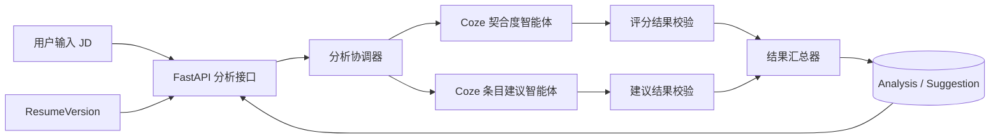
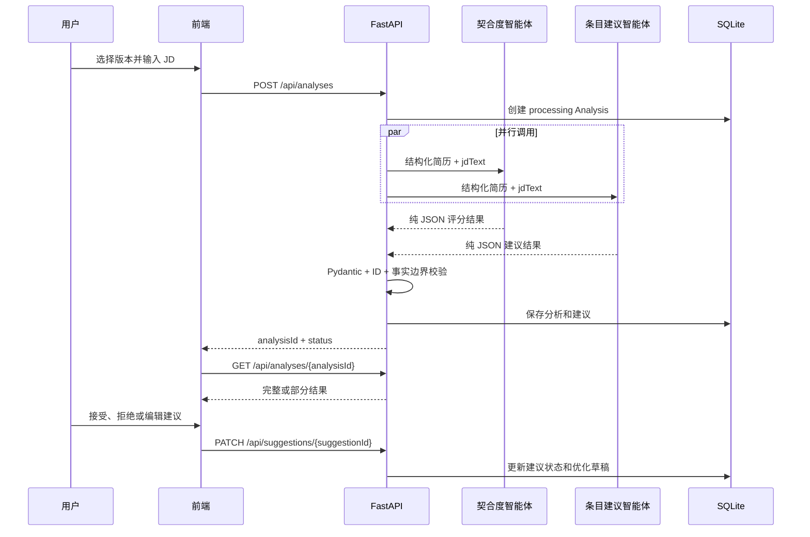

# 接入概述

## 1. 能力说明

JD 分析服务以一个不可变的简历版本和用户输入的完整 JD 文本为输入，并行调用两个 Coze 智能体：

- 契合度分析智能体：计算 0 到 100 的总体契合度、评分维度、逐条匹配状态和缺失要求。
- 条目建议智能体：针对已有简历条目生成文本优化建议。

服务不负责解析简历文件。简历必须先通过手动录入或文件导入形成 `ResumeVersion`。

## 2. 能力边界

支持：

- 用户直接输入或粘贴中文 JD 文本。
- 对已保存的 `ResumeVersion` 执行分析。
- 返回可解释的契合度百分比。
- 返回高、中、低三级的逐条相关度。
- 标出 JD 要求但简历未体现的能力。
- 针对已有条目提供原文、建议文本和修改理由。
- 用户逐条接受、拒绝或编辑建议。

不支持：

- 上传 JD 文件。
- 分析未保存的 Draft。
- 推断候选人没有明确写出的经历或能力。
- 自动将建议写入原始版本。
- 让 Coze 直接生成整份优化简历。
- 将契合度解释为录用概率。

## 3. 双智能体架构



两个智能体共用同一份输入快照，但输出契约不同。后端不得将一个智能体的自然语言输出直接拼接给另一个智能体，以免产生隐式依赖和不可重复结果。

## 4. 业务流程



## 5. 状态流

### 5.1 Analysis 状态

| 状态 | 含义 | 是否可读结果 | 是否可重试 |
| --- | --- | --- | --- |
| `processing` | 至少一个智能体尚未结束 | 否 | 否 |
| `completed` | 两个智能体均成功且通过校验 | 是 | 否 |
| `partial_failed` | 一个智能体成功，另一个失败 | 仅成功部分 | 是 |
| `failed` | 两个智能体均失败，或汇总结果不可用 | 否 | 是 |

状态只允许：

```text
processing -> completed
processing -> partial_failed
processing -> failed
partial_failed -> processing -> completed|partial_failed|failed
failed -> processing -> completed|partial_failed|failed
```

### 5.2 Provider 状态

契合度智能体和建议智能体分别记录：`queued`、`running`、`succeeded`、`failed`。

## 6. 契合度计算

总体契合度采用固定四维评分，权重总和必须为 100：

| 维度 | 权重 | 说明 |
| --- | ---: | --- |
| 核心要求覆盖 | 40 | JD 必备职责和硬性要求是否有简历证据 |
| 经历证据相关性 | 30 | 工作、实习和项目经历与岗位任务的关联程度 |
| 技能关键词覆盖 | 20 | 技术、工具、证书和领域关键词覆盖情况 |
| 表达完整度 | 10 | 相关条目是否具体、清楚且有可验证描述 |

每个维度返回 `score`，取值为 0 到该维度 `weight`。总体分满足：

$$
overallScore = \sum score_i
$$

分数区间只用于展示契合程度：

| 分数 | 展示等级 |
| --- | --- |
| 80-100 | 高契合 |
| 60-79 | 中等契合 |
| 0-59 | 低契合 |

评分不能使用年龄、性别、籍贯、出生年月、姓名等个人属性。基本信息只允许使用 `jobTarget` 和公开作品链接等与岗位直接相关的内容。

## 7. 并行失败与降级

- 两个智能体均成功：`completed`，返回完整结果。
- 契合度成功、建议失败：`partial_failed`，展示分数和匹配结果，建议区域显示失败并允许重试。
- 契合度失败、建议成功：`partial_failed`，不显示总体分，允许展示已校验建议并明确标记评分不可用。
- 两个智能体均失败：`failed`，不返回伪造的默认分数或建议。
- 任一智能体返回非法 JSON、未知 ID 或越权内容，视为该智能体失败。

重试默认只调用失败的智能体。客户端也可以通过 `targets` 显式指定重试目标。

## 8. 数据与隐私

- Coze Token、智能体 ID 和工作流 ID只保存在后端环境变量中。
- 前端不得直接调用 Coze。
- 日志只记录 `analysisId`、Provider 状态、耗时和错误码，不记录完整简历或 JD。
- 发送给 Coze 的简历基本信息应移除姓名、手机号、邮箱、籍贯、出生年月和性别。
- 数据库保存原始 `jdText`，用于结果追溯和重试；不得将其写入普通应用日志。
