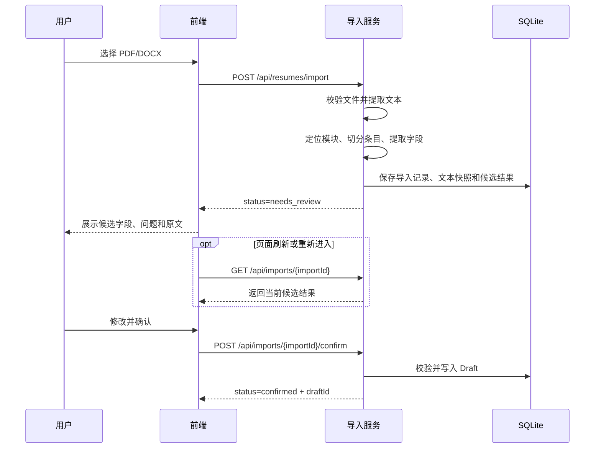

# 接入概述

## 1. 能力说明

简历导入服务接收文本型 PDF 或 DOCX 文件，提取原始文本，按规则识别简历模块和字段，并返回可人工校正的候选结果。导入服务不调用 Coze，也不直接创建不可变的 `ResumeVersion`。

适用场景：

- 用户通过已有简历文件创建结构化简历。
- 用户重新打开未确认的导入结果并继续校正。
- 用户确认候选结果，将其保存为可编辑草稿。

不适用场景：

- 扫描版 PDF、图片或 OCR。
- 复杂视觉版式、头像、颜色、字体和装饰信息复刻。
- 整段简历文本粘贴导入。
- JD 匹配、内容改写或事实补全。

## 2. 接入流程



## 3. 接入步骤

1. 调用文件导入接口，上传一个 PDF 或 DOCX。
2. 保存响应中的 `importId`，它是后续查询和确认的唯一标识。
3. 根据 `issues` 和 `confidenceSummary` 展示待确认项。
4. 用户修改 `structuredDocument`，不得修改服务端生成的 `importId`、section ID 和 item ID。
5. 调用确认接口提交完整 `structuredDocument`。
6. 使用返回的 `draftId` 进入正常简历编辑流程。

## 4. 状态流

| 状态 | 含义 | 允许操作 |
| --- | --- | --- |
| `processing` | 文件正在提取和识别 | 查询状态，不可确认 |
| `needs_review` | 候选结果已生成，等待人工校正 | 查询、编辑、确认 |
| `confirmed` | 已确认并写入 Draft | 查询，不可重复确认 |
| `failed` | 文件校验、提取或识别失败 | 查看错误，重新上传 |

```text
processing -> needs_review -> confirmed
processing -> failed
```

## 5. 识别流程

服务采用规则优先策略：

1. 模块定位：根据中文标题词典定位基本信息、教育经历、工作/实习经历、项目经历、技能、证书与奖项、自定义模块。
2. 条目切分：根据时间区间、编号、项目符号和换行切分条目。
3. 字段提取：根据正则、关键词锚点和上下文提取字段。
4. 置信度标记：无法稳定判断、出现多个候选或依赖弱上下文时标记为 `low`。

## 6. 数据保留

| 层 | 内容 | 用途 |
| --- | --- | --- |
| 导入记录 | 来源、文件元数据、状态、错误、时间 | 跟踪一次导入操作 |
| 原始文本快照 | 提取文本、页码或段落位置 | 回显原文、重新拆分、问题追溯 |
| 结构化候选 | `ResumeDocument`、置信度、问题、未映射文本 | 人工校正和确认 |

原始上传文件只在解析阶段临时保存。成功提取后删除原文件，不在数据库或版本历史中长期保存。

## 7. 通用协议

- API 前缀：`/api`
- 字符编码：UTF-8
- 普通请求和响应：`application/json`
- 文件上传：`multipart/form-data`
- 日期时间：ISO 8601，带时区
- 年月：`YYYY-MM`
- 请求追踪：每个响应都返回 `requestId`
- 文件上限：10 MB，即 10,485,760 字节

## 8. 隐私要求

- 日志不得记录完整原始文本、手机号、邮箱、籍贯或出生年月。
- API 错误详情不得回显本地文件路径。
- 示例数据必须脱敏，不得提交真实简历。
- 前端不得将简历内容写入浏览器控制台或第三方分析服务。
