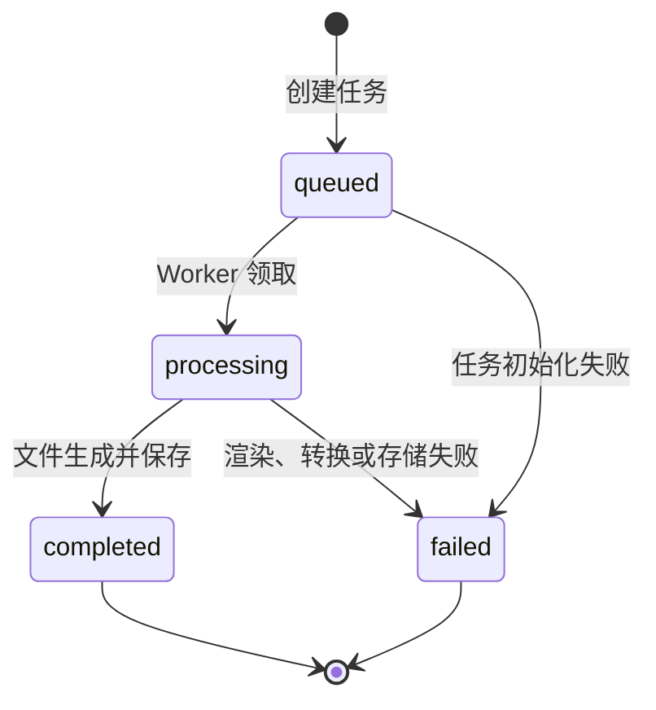

# 接入概述

## 1. 能力边界

简历导出服务将已保存的不可变 `ResumeVersion` 渲染为 DOCX 或 PDF。服务不接受 Draft、不修改简历内容，也不提供在线模板编辑能力。

首版提供两份人工维护的 Word 模板：

- `classic_single_column`：经典单栏，适合通用岗位和机器解析。
- `modern_two_column`：现代双栏，适合强调技能与项目的岗位。

## 2. 标准流程

1. 客户端调用 `GET /api/export-templates` 获取可用模板。
2. 客户端提交版本 ID、模板 ID 和导出格式，服务返回 `202 Accepted` 和 `exportId`。
3. 后台任务读取不可变版本，校验模板，生成 DOCX；PDF 请求继续调用 LibreOffice Headless 转换。
4. 客户端轮询 `GET /api/exports/{exportId}`，直到状态为 `completed` 或 `failed`。
5. 状态为 `completed` 后，客户端访问 `downloadUrl` 下载附件。

建议轮询间隔为 1 秒；连续轮询 30 秒后应降低频率，不应并发轮询同一任务。

## 3. 状态流

`completed` 和 `failed` 为终态。首版不支持取消或重试原任务；用户可重新创建导出任务。

## 4. 一致性与重复请求

- `ResumeVersion`、模板版本和导出格式共同决定文件内容。
- 相同输入在模板版本不变时必须得到内容一致的文件。
- 创建接口不是幂等接口；每次成功调用都会创建新的 `ExportRecord`。
- 服务可以复用已生成的内部文件，但仍需返回新的 `exportId`，不得返回本地存储路径。
- 文件名不参与内容计算，由服务端根据简历标题、模板和格式安全生成。

## 5. 文件与安全

- DOCX MIME：`application/vnd.openxmlformats-officedocument.wordprocessingml.document`。
- PDF MIME：`application/pdf`。
- 下载响应使用 `Content-Disposition: attachment`。
- 服务端必须清理文件名中的路径分隔符、控制字符和保留字符。
- 导出记录保存内部 `filePath`，API 只返回受控的 `downloadUrl`。
- 错误详情不得暴露模板物理路径、LibreOffice 命令、堆栈或临时目录。
- 导出文件应按部署配置定期清理；记录保留策略与文件保留策略应分离。

## 6. 前端处理建议

- `queued`、`processing`：显示生成中并继续轮询。
- `completed`：停止轮询并启用下载操作。
- `failed`：停止轮询，显示可操作提示，并允许重新创建任务。
- `EXPORT_NOT_READY`：刷新任务状态，不应立即重复发起下载。
- `EXPORT_DEPENDENCY_MISSING`：提示 PDF 服务暂不可用；若业务允许，可改选 DOCX。
